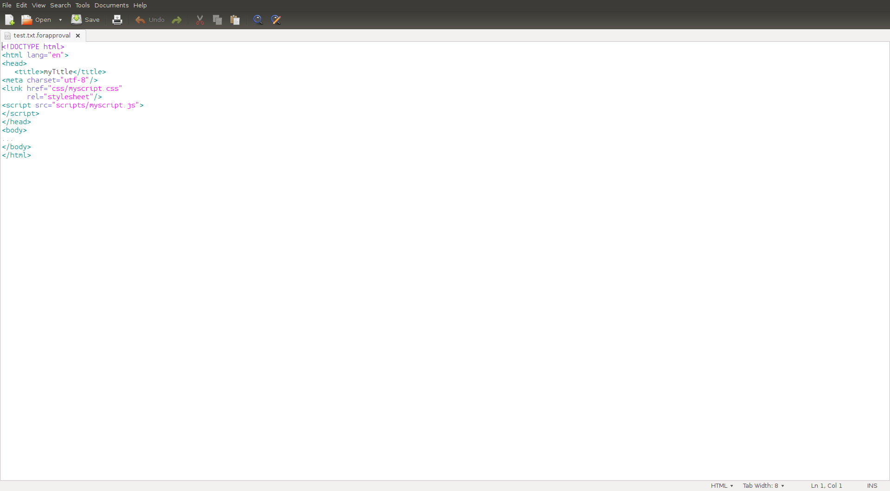
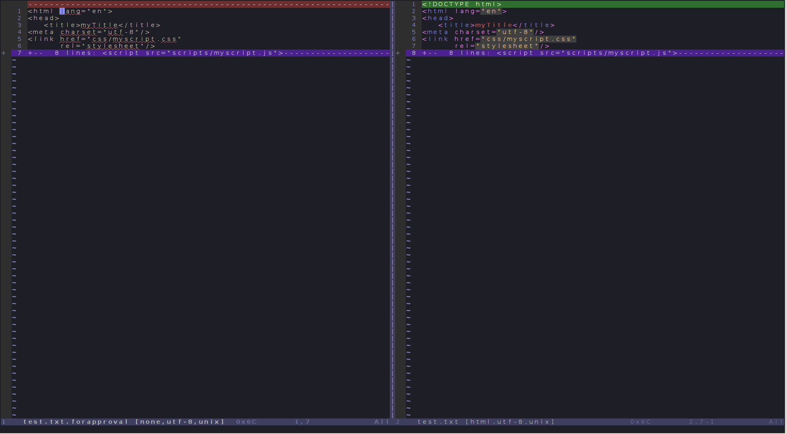
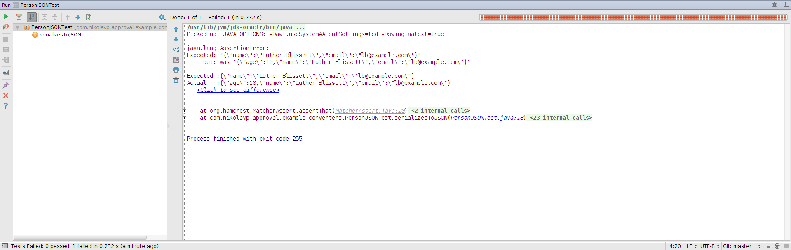
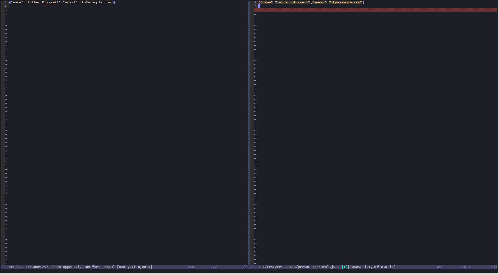
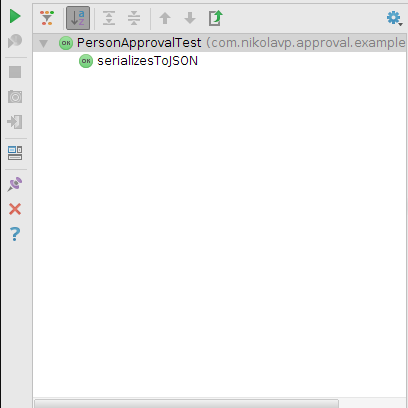
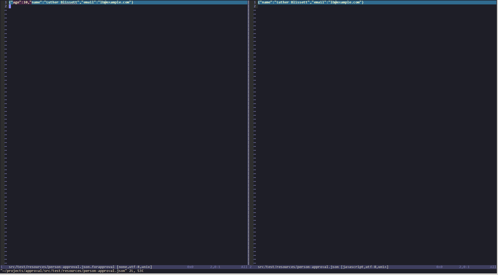

.. toctree::
   :maxdepth: 1

===========
User Manual
===========

Simple example of the library
=============================

Let's try to test the simplest example possible:

.. literalinclude:: /../../src/test/java/com/nikolavp/approval/example/SimpleExample.java
    :language: java

now this class is not rocket science and if we want to test **getResult()**, we would write something like the following in JUnit:

.. literalinclude:: /../../src/test/java/com/nikolavp/approval/example/SimpleExampleTest.java
    :language: java

this is quite terse and short. Can we do better? Actually because we support strings out of the box, approval is a lot shorter

.. literalinclude:: /../../src/test/java/com/nikolavp/approval/example/SimpleExampleApprovalTest.java
    :language: java

when the latter is executed you will be prompted in your tool of choice to verify the result from **getResult()**. Verifying the result will vary from your tool of choice because some of them allow you to control the resulting file and others just show you what was the verification object.

To see it in action we will look at two possible reporters:

Gedit
^^^^^^^^^^^^^^^^^^^^^^^^^^^^^^^

Gedit is just a simple editor. When we run the test it will show us the string representation:

as you can see this is the string representation of the result opened in gedit. If we close gedit we will prompted by a confirm window which will ask us if we approve the result or it is not OK. On not OK the test will fail with an :java:ref:`AssertionError` and otherwise the test will pass and will continue to pass until the returned value from **getResult()** changes.

GvimDiff
^^^^^^^^^^^^^^^^^^^^^^^^^^^^^^
Gvimdiff is much more powerful than gedit. If we decide to use it then we got the power in our hands and we can decide if we want the file or not(there will be no confirmation window). Here is how it looks like:

.. image:: images/gvimdiff-example.png

as you can see on the left side is the result from the test run and on the right side is what will be written for consecutive test runs. If we are ok with the result we can get everything from the left side, save the right side and exit vim. The test will now pass and will continue to pass until the returned value from **getResult()** changes.

Let's say someone changes the code and it no longer contains a DOCTYPE declaration. The reporter will fire up and we will get the following window:

we can approve the change or exit our tool and mark the result as invalid.

Converters usecase
==================
In this section we will show you how to use a custom converter for a class that you have written yourself and want to verify. For our example we will use the excellent jackson library. 

Let's say you want to verify that the following entity object returned from your restful API will be represented properly in JSON by jackson:

.. literalinclude:: /../../src/test/java/com/nikolavp/approval/example/converters/Person.java
    :language: java
    :lines: 1-

we will use the following **person** as an example:

.. literalinclude:: /../../src/test/java/com/nikolavp/approval/example/converters/PersonJSONTest.java
    :language: java
    :lines: 16

Normal setup with assertions
^^^^^^^^^^^^^^^^^^^^^^^^^^^^
now in normal circumstances you will now have to do the following:

* create a file representing the json serialization with the following content(for example named *person.json*):

.. literalinclude:: /../../src/test/resources/person.json
    :language: javascript

* read the content of the file
* run ObjectMapper on the person object to get the json representation
* compare the last two results and verify that they are the same

your code might be something like the following using `guava <http://code.google.com/p/guava-libraries/>`_

.. literalinclude:: /../../src/test/java/com/nikolavp/approval/example/converters/PersonJSONTest.java
    :language: java

now run the tests and they should pass. Of course software is all about change so if you later change the representation of the person and add an age field, you will have to do the following:

* run the tests and see them fail with message that would say something like the following:

* now you will have to manually look at that message, see the difference between the two and change the person.json file appropriately to match the newly added age field(this is all manual work and you know what manual work leads to, right?)

Using approval
^^^^^^^^^^^^^^
Using approval, we will first have to build a converter that converts our Person class to a string form(currently the library doesn't have a jackson converter). A simple converter like the following will work:

.. literalinclude:: /../../src/test/java/com/nikolavp/approval/example/converters/JacksonConverter.java
    :language: java

.. note::
    This converter is super generic. It can convert any object that is accepted by jackson(hence the name of the converter)

now let's write our test:

.. literalinclude:: /../../src/test/java/com/nikolavp/approval/example/converters/PersonApprovalTest.java
    :language: java

.. note::
    we didn't have to write the person.json file, it will be generated for us the first time the test is run

here is what we get when we run the test for the first time:

basically the library is asking us if we "approve" the result on the left side and what parts of it we want to move to the right side(most of the time all of it). In this case we want the whole left side so we get the following:

now when we save the right hand side and close our tool, we can see the green bar in our test runner(intellij in this case)

running the tests again will continue to pass. What's interesting is if we change the Person class and add an age field. We just rerun the tests but now they won't pass, we will be prompted in our tool again with something like the following:

we can "approve" the change(move the change from left to right) or we can close the tool and state that the new value is invalid; we should then fix our code.

What's interesting in the approval case is that we didn't have to manually check the new value and verify that it is valid in the console view. We got a good looking diff window that prompt us for verification.

.. note::
    This guide is using an example from the `dropwizard testing documentation <http://dropwizard.io/manual/testing.html>`_

